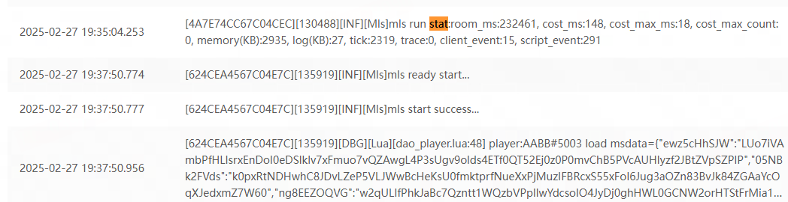

# MLS API 相关文档

# MLS 基础API

## 日志相关
### 日志级别
- Log.Debug  
在本地调试用的日志，发布后，则将会屏蔽   
- Log.Info
打印一些info日志，便于跟踪脚本的核心数据修改  
- Log.Error
脚本逻辑错误，或者出现错误异常，需要作者来进行修复，发布版本的时候  
### 日志限制
日志有频率限制: 请在关键的地方打印日志，如果超过日志频率，则将不会输出日志  
脚本报错日志： 同一个地方的报错，5分钟只会记录一条  
常规日志日志: 100秒最多1000条日志，超过后，进行熔断，下一个周期将会有日志出现  
每条日志的内容上限为:2000个字节  
在正式环境中，debug 级别的日志将会忽略  
### 日志示例:  
  
```
[4A7E74CC67C04CEC][130488][INF][Mls]mls run stat:room_ms:232461, cost_ms:148, cost_max_ms:18, cost_max_count:0, memory(KB):2935, log(KB):27, tick:2319, trace:0, client_event:15, script_event:291
```
- 房间唯一ID
- 房间号(在平台客户端中可以看到的6位房间号)
- 日志级别 DBG INF WRN ERR FTL(脚本报错日志) 
- 日志模块 Mls 为脚本底层人日志 Lua 为脚本的日志
- 日志内容  
### 实例中的日志内容有
- room_ms 脚本房间的运行时间(毫秒)
- cost_ms 累计脚本运行消耗时间(毫秒)
- cost_max_ms 脚本的长执行时间(毫秒)
- cost_max_count 脚本执行超过超过100ms的次数统计
- memory(KB) 脚本的内存占用(KB)
- log(KB) 脚本的日志写入大小(KB)
- tick 脚本执行的tick数
- trace 脚本执行的异常次数
- client_event 客户端事件次数(war3->脚本)
- script_event 脚本事件次数(脚本->war3)
### 脚本执行异常退出的常用情况  
- 当脚本单次执行时间超过5秒，则脚本将会退出 UnsafeCostTime
- 当脚本执行的超时次数达到20次后，则脚本将会退出 UnsafeTimeout
- 当脚本的内存占用超过10M，则脚本将会退出 UnsafeMemory


## 定时器相关
定时器的单位为`秒`
- Timer.After  
    延后执行
    ```
    Timer.After(10, function()
        Log.Debug('after 10000ms')
    end)
    ```

- Timer.NewTicker  
    循环定时器 
    ```
    -- 测试循环定时器
    local timer_count = 0
    local timer
    timer = Timer.NewTicker(1, function()
        Log.Debug('timer 1000ms')
        timer_count = timer_count + 1
        if timer_count >= 5 then
            timer:Cancel()
            Log.Debug('timer cancelled')
        end
    ```

## 注册脚本事件
- RegisterEvent  
    注册脚本事件   
    ```
    -- 获取boss信息
    local function getboss(id, ename, evalue, player_index)
        get_boss_req = json.decode(evalue)
        local round = get_boss_req["round"]
        if round == nil then
            LogDebug("getboss miss round args")
            return
        end
        get_boss_resp = {}
        get_boss_resp["x"] = 100
        get_boss_resp["y"] = 100
        get_boss_resp["round"] = round
        local result = MsSendMlEvent(player_index, "getboss", json.encode(get_boss_resp))
    end

    -- 获取boss信息
    RegisterEvent('getboss', getboss)
    ```

    ***注册函数的参数***  
    | 参数名         | 类型       | 说明                      |
    | :----------   | :-----     | :------------------------ |
    | id      | int              | 注册编号                  |
    | ename   | string           | 事件ID                  |
    | evalue  | string           | 事件数据                 |
    | player_index  | int        | 玩家槽位                  |

    - 注册编号 id ,通过UnregisterEvent(id) 可以取消事件注册  
    - 如果player_index 为-1，则事件为房间事件 
    - 事件ID ，且不能用_开头(为了防止和平台内部的进行冲突), 可以为 数字，字母，: 符号构成   最大长度限制为32个字节  
    - 事件数据, 最大长度限制为900个字节  


# 玩家相关API
## MsGetPlayerName
***描述***  
    获取玩家昵称  
***参数***  
| 参数名         | 类型       | 说明                      |
| :----------   | :-----     | :------------------------ |
| player_index  | int        | 玩家槽位                  |

***返回***  
| 返回值      | 类型   | 说明                  |
| :---------- | :----- | :-------------------- |
| -  | string | 玩家昵称                  |

***注意事项***    
- 暂无

## MsGetPlayerMapLevel
***描述*** 
    获取玩家当前地图等级  
***参数***  
| 参数名         | 类型       | 说明                      |
| :----------   | :-----     | :------------------------ |
| player_index  | int        | 玩家槽位                  |

***返回***  
| 返回值      | 类型   | 说明                  |
| :---------- | :----- | :-------------------- |
| -           | int    | 玩家地图等级           |

***注意事项***    
- 暂无  

## MsGetPlayerMapExp
***描述***  
    获取玩家当前地图经验  
***参数***  
| 参数名         | 类型       | 说明                      |
| :----------   | :-----     | :------------------------ |
| player_index  | int        | 玩家槽位                  |

***返回***  
| 返回值      | 类型   | 说明                  |
| :---------- | :----- | :-------------------- |
| -           | int    | 玩家地图经验           |

***注意事项***    
- 暂无  

## MsGetPlayedTime
***描述***  
    获取玩家当前地图时间  
***参数***  
| 参数名         | 类型       | 说明                      |
| :----------   | :-----     | :------------------------ |
| player_index  | int        | 玩家槽位                  |

***返回***  
| 返回值      | 类型   | 说明                  |
| :---------- | :----- | :-------------------- |
| -           | int    | 玩家地图时间           |

***注意事项***     
- 返回单位为秒  


## MsGetTestPlayTime
***描述***  
    获取玩家此图测试大厅游玩时间  
***参数***  
| 参数名         | 类型       | 说明                      |
| :----------   | :-----     | :------------------------ |
| player_index  | int        | 玩家槽位                  |

***返回***  
| 返回值      | 类型   | 说明                  |
| :---------- | :----- | :-------------------- |
| -           | int    | 玩家地图时间           |

***注意事项***     
- 返回单位为秒  

## MsGetPlayedCount
***描述***  
    获取玩家当前地图次数  
***参数***  
| 参数名         | 类型       | 说明                      |
| :----------   | :-----     | :------------------------ |
| player_index  | int        | 玩家槽位                  |

***返回***  
    1. 玩家当前地图次数  
***注意事项***    
- 暂无  

# 当前对局相关

## MsGetRoomStartTs
***描述***  
    获取游戏开始时间  
***参数***  
| 参数名         | 类型       | 说明                      |
| :----------   | :-----     | :------------------------ |
| 无参数         | -          | 无参数                    |

***返回***  
| 返回值      | 类型   | 说明                  |
| :---------- | :----- | :-------------------- |
| -           | int    | 返回游戏开始时间戳       |

***注意事项***    
- 返回值为时间戳(秒)  

## MsGetRoomLoadedTs
***描述***  
    获取游戏加载完成时间  
***参数***  
| 参数名         | 类型       | 说明                      |
| :----------   | :-----     | :------------------------ |
| 无参数         | -          | 无参数                    |

***返回***  
| 返回值      | 类型   | 说明                  |
| :---------- | :----- | :-------------------- |
| -           | int    | 获取游戏加载完成时间       |

***注意事项***    
- 返回值为时间戳(秒)  

## MsGetRoomGameTime
***描述***  
    获取游戏已经过去多长时间  
***参数***  
| 参数名         | 类型       | 说明                      |
| :----------   | :-----     | :------------------------ |
| 无参数         | -          | 无参数                    |

***返回***  
| 返回值      | 类型   | 说明                  |
| :---------- | :----- | :-------------------- |
| -           | int    | 返回游戏对局已经过去多次时间       |

***注意事项***    
- 开始时间为游戏加载完成开始计时  
- 单位为秒

## MsGetRoomPlayerCount
***描述***  
    获取对局中玩家个数  
***参数***  
| 参数名         | 类型       | 说明                      |
| :----------   | :-----     | :------------------------ |
| 无参数         | -          | 无参数                    |

***返回***  
| 返回值      | 类型   | 说明                  |
| :---------- | :----- | :-------------------- |
| -           | int    | 玩家个数       |

***注意事项***    
- NPC和AI均不算  

## MsGetRoomModeId
***描述***  
    获取对局模式ID  
***参数***  
| 参数名         | 类型       | 说明                      |
| :----------   | :-----     | :------------------------ |
| 无参数         | -          | 无参数                    |

***返回***  
| 返回值      | 类型   | 说明                  |
| :---------- | :----- | :-------------------- |
| -           | int    | 返回模式ID       |

***注意事项***    
- 暂无  

# 玩家道具相关
## MsGetPlayerItem 
***描述***  
    获取玩家道具  
***参数***  
| 参数名         | 类型       | 说明                      |
| :----------   | :-----     | :------------------------ |
| player_index  | int        | 玩家槽位                  |
| key           | string     | 道具key                   |

***返回值***    
| 返回值      | 类型   | 说明                  |
| :---------- | :----- | :-------------------- |
| -           | int    | 玩家道具数量       |

***注意事项***    
- 暂无  


## MsConsumeItem
***描述***  
    获取玩家道具  
***参数***  
| 参数名         | 类型       | 说明                      |
| :----------   | :-----     | :------------------------ |
| player_index  | int        | 玩家槽位                  |
| iteminfo           | string     |  道具消耗信息json字符串： '{"key1": 1, "key2": 1}' 道具key：消耗数量    |

***返回值***    
| 返回值      | 类型   | 说明                  |
| :---------- | :----- | :-------------------- |
| -           | uint32    | trans_id：业务id， 作者用此关联回调结果 |

***注意事项***    
- 暂无  


# 玩家存档相关

## MsGetScriptArchive 
***描述***  
    获取脚本存档数据  
***参数***  
| 参数名         | 类型       | 说明                      |
| :----------   | :-----     | :------------------------ |
| player_index  | int        | 玩家槽位                  |

***返回值***  
| 返回值      | 类型   | 说明                  |
| :---------- | :----- | :-------------------- |
| -           | string    | 返回玩家存脚本档数据       |

***注意事项***    
- 脚本数据不存在或者为空时候，返回nil  
- 脚本存档需要脚本代码自行进行反序列号  
- 同时在玩家退出的时候序列号  
 
## MsSaveScriptArchive 
***描述***  
    保存脚本存档数据  
***参数***  
| 参数名         | 类型       | 说明                      |
| :----------   | :-----     | :------------------------ |
| player_index  | int        | 玩家槽位                  |
| script_data   | string     | 脚本存档序列化后的数据      |

***返回值***  
| 返回值      | 类型   | 说明                  |
| :---------- | :----- | :-------------------- |
| -           | int    | 操作结果       |

***注意事项***    
- 同时在玩家退出的需要调用保存脚本存档  
- 事件数据, 最大长度限制为1024*1024个字节（则1M的内容)


## MsGetCommonArchive 
***描述***  
    获取普通存档数据  
***参数***  
| 参数名         | 类型       | 说明                      |
| :----------   | :-----     | :------------------------ |
| player_index  | int        | 玩家槽位                  |
| key           | string     | 存档key                   |
 
***返回值***  
| 返回值      | 类型   | 说明                  |
| :---------- | :----- | :-------------------- |
| -           | string    | 返回存档数据       |

***注意事项***    
- 存档key不存在，或者存档key对应的数据为空，返回nil  

## MsGetReadArchive 
***描述***  
    获取只读存档数据  
***参数***  
| 参数名         | 类型       | 说明                      |
| :----------   | :-----     | :------------------------ |
| player_index  | int        | 玩家槽位                  |
| key           | string     | 存档key                   |
  
***返回值***  
| 返回值      | 类型   | 说明                  |
| :---------- | :----- | :-------------------- |
| -           | string    | 返回只读存档数据       |
 
***注意事项***    
- 存档key不存在，或者存档key对应的数据为空，返回nil  

## MsSetReadArchive 
***描述***  
    保存只读存档数据  
***参数***  
| 参数名         | 类型       | 说明                      |
| :----------   | :-----     | :------------------------ |
| player_index  | int        | 玩家槽位                  |
| key           | string     | 存档key                   |
| key           | string     | 存档数据                   |
 
***返回值***  
| 返回值      | 类型   | 说明                  |
| :---------- | :----- | :-------------------- |
| -           | int    | 操作结果       |

***注意事项***    
- 返回值为0，表示操作成功，错误码见错误码列表  


## MsGetCfgArchive
***描述***  
    获取全局只读存档数据  
***参数***  
| 参数名         | 类型       | 说明                      |
| :----------   | :-----     | :------------------------ |
| player_index  | int        | 玩家槽位                  |
| key           | string     | 存档key                   |
  
***返回值***  
| 返回值      | 类型   | 说明                  |
| :---------- | :----- | :-------------------- |
| -           | string    | 返回全局只读存档数据       |
 
***注意事项***    
- 存档key不存在，或者存档key对应的数据为空，返回nil  

# 脚本API

## MsSendMlEvent
***描述***  
    发送脚本存档数据  
***参数***  
| 参数名         | 类型       | 说明                      |
| :----------   | :-----     | :------------------------ |
| player_index  | int        | 玩家槽位                  |
| ename           | string     | 事件ID                   |
| evalue           | string     | 事件数据                   |
 
***返回值***  
| 返回值      | 类型   | 说明                  |
| :---------- | :----- | :-------------------- |
| -           | int    | 操作结果       |

***注意事项***    
- 返回值为0，表示操作成功，错误码见错误码列表    
- 事件ID ，且不能用_开头(为了防止和平台内部的进行冲突), 可以为 数字，字母，: 符号构成   最大长度限制为32个字节  
- 事件数据, 最大长度限制为900个字节  

## MsEnd
***描述***  
    停止脚本执行  
***参数***  
| 参数名         | 类型       | 说明                      |
| :----------   | :-----     | :------------------------ |
| player_index  | int        | 玩家槽位                  |
| reason           | string     | 原因                   |
   
***返回值***  
| 返回值      | 类型   | 说明                  |
| :---------- | :----- | :-------------------- |
| -           | int    | 操作结果       |

***注意事项***    
- 脚本需要立即停止脚本房间的执行时候，调用  

# 脚本服务同步给脚本内置事件

## _roomloaded
***描述***  
    房间加载完成  
***参数***  
1. 事件内容  房间加载的核心信息，json格式  
```json
{ 
"players": [0]
}
```
 players 为对局中的，玩家player_index 

## _roomover
***描述***  
房间结束  
***参数***  
1. 事件内容  房间加载的核心信息，json格式  
    ```json
    { 
    "reason": "GameEnd"
    }
    ```
    -- reason 为游戏结束原因  

## _playerexit
***描述***  
    玩家退出房间  
***参数***  
1. 事件内容  玩家退出的核心信息，json格式  
```json
{ 
"reason": "Logout"
}
```
2. reason 为玩家退出原因  

## _playerleave
***描述***  
    玩家暂时离开游戏，等待断线重连  
***参数***  
1. 事件内容  房间加载的核心信息，json格式  
    ```json
    { 
    "reason": "Disconnect"
    }
    ```
2. reason 为玩家离开原因

## _playerjoin
***描述***  
    玩家重新加入游戏  
***参数***  
1. 事件内容  房间加载的核心信息，json格式  
```json
{ 
"reason": "Connect"
}
```
2. reason 玩家重新加入游戏原因  

# 脚本服务同步给War3事件

## _rdata
***描述***  
    当脚本调用MsSetReadArchiv时候，将会触发可读存档更新事件 

***参数***  
1. 事件内容  "可读存档key\t可读存档value"  
    - 事件数据为 可读存档key\t可读存档value，当中用\t 分隔，如果存档中存在\t ，则作者需自行调整  


## _citemret
***描述***  
    当脚本调用MsConsumeItem时候，将会触发道具消耗结果返回 

***参数***  
1. 事件内容  '{"trans_id": 1, "errnu":0, "iteminfo": {"itemkey1": 10, "item_key2":20}}'
    - 事件数据: trans_id 业务id，与MsConsumeItem返回值相同；errnu：错误码 0 未消耗成功；iteminfo：此次业务消耗道具信息，与MsConsumeItem传入参数iteminfo相同


## _mlroomfail
***描述***  
当云脚本启动失败后（即脚本还没有进入到运行状态后），则发送失败事件 
游戏逻辑自动进行决定是否退出游戏 
1. 例如脚本下载失败 
2. 脚本LUA 脚本加载失败 
3. 脚本存档加载失败 

***参数***  
1. 事件内容  " 失败原因"    

# 常用错误码

| 错误码      | 类型   | 描述                  |
| :---------- | :----- | :-------------------- |
| 0           | int    | 正常       |
| 1           | int    | 未知错误       |
| 2           | int    | 房间不存在       |
| 3           | int    | 玩家不存在           |
| 4           | int    | 事件Key长度不符合规范       |
| 5           | int    | 事件Key内容不符合规范       |
| 6           | int    | 事件Value长度不符合规范           |
| 7           | int    | 事件Value内容不符合规范           |
| 8           | int    | 存档Key长度不符合规范           |
| 9           | int    | 存档Value长度不符合规范           |
| 10           | int    | 文本内容超过限制           |
| 11           | int    | 脚本存档超过长度限制           |
| 1259         | int    | 道具数量不足           |
| 10133        | int    | 包裹内没有指定的物品           |