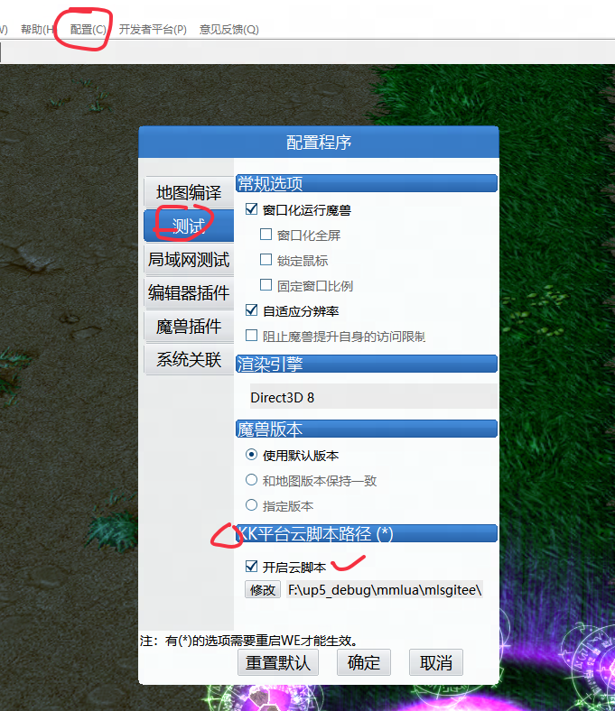
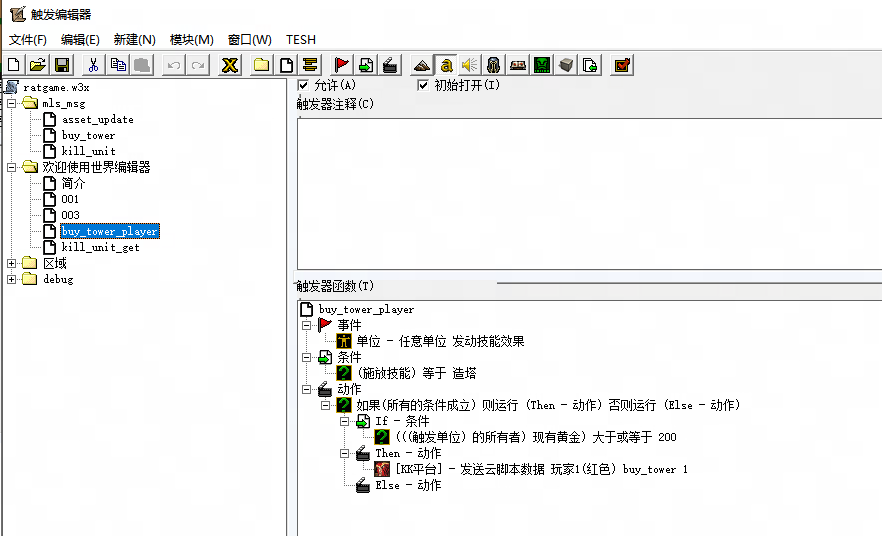
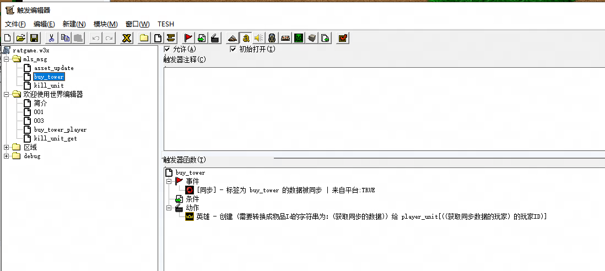
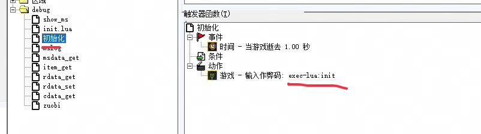
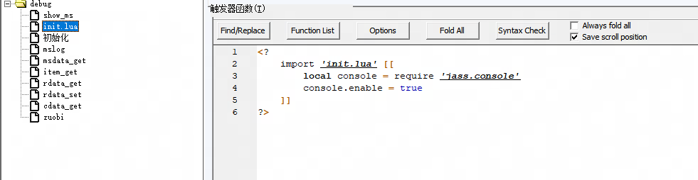
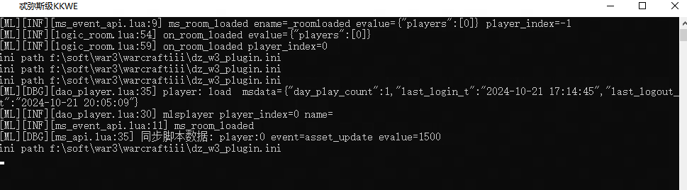

# MLS 本地快速开发流程

## 使用步骤
### 1. 下载kkwe
>  找耗子单独要来测试吧，暂不外发

### 2.运行kkwe, 配置脚本路径


### 3.开心制作地图拉
#### 发送脚本事件
判断玩家的金币足够，购买一个塔  


#### 接受脚本事件
地图逻辑脚本 扣除金币，随机一个塔后，地图收到消息，创建一个塔


#### debug阶段
打开控制台,查看地图脚本的运行结果



地图运行后，可以查看本地的地图脚本执行逻辑


#### 是不是很简单呢？ 
那还不赶快的做一个地图来试试呢？ 

## 本地开发脚本存档的数据
在本地开发中，可以直接修改dz_w3_plugin.ini 的文件，模拟一些平台服务的数据，同时脚本存档也将会写在MLS-ScriptArchive key中
### 存放路径
    (War3客户端安装路径)/dz_w3_plugin.ini 
### 配置数据示例
```
[DzAPI]
MLS-ReadArchive-AA-0=a
MLS-ReadArchive-boss_kill-0=232
MLS-MsGetPlayerItem-VIP001-0=1
RED-0-5-boss_kill--0-0-0-0=
MLS-ScriptArchive-0={"last_login_t":"2024-10-21 15:03:21","last_logout_t":"2024-10-21 15:04:28","day_play_count":1}
```
### 配置参数解释
详细的API返回可以参考[API文档](./API.md)  
dz_w3_plugin.ini 的配置数据说明
- MLS-ReadArchive  
可读存档
- MLS-MsGetPlayerItem 
玩家背包道具


