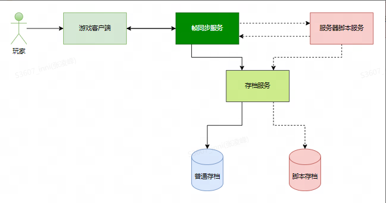
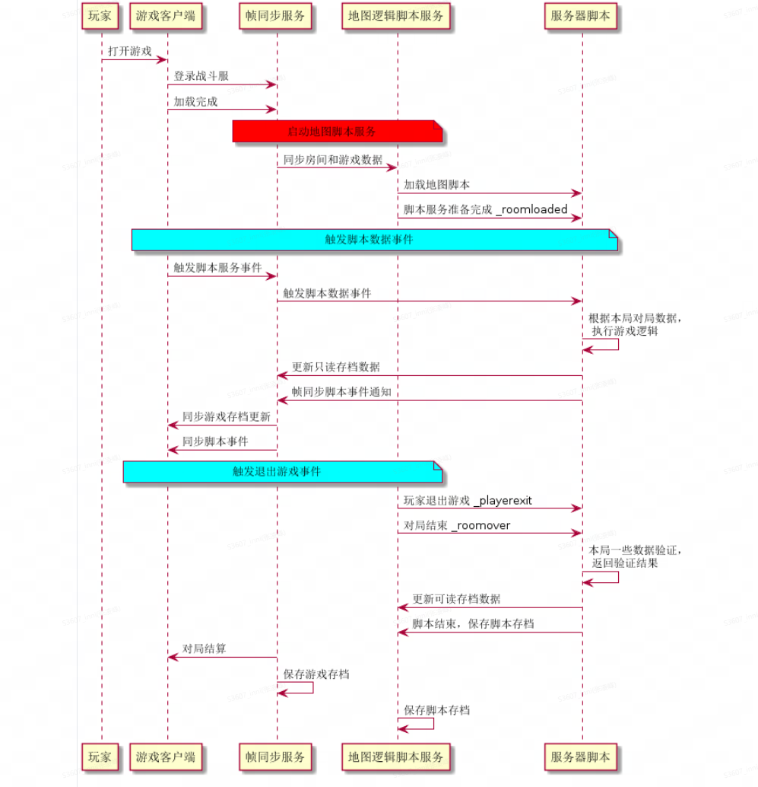
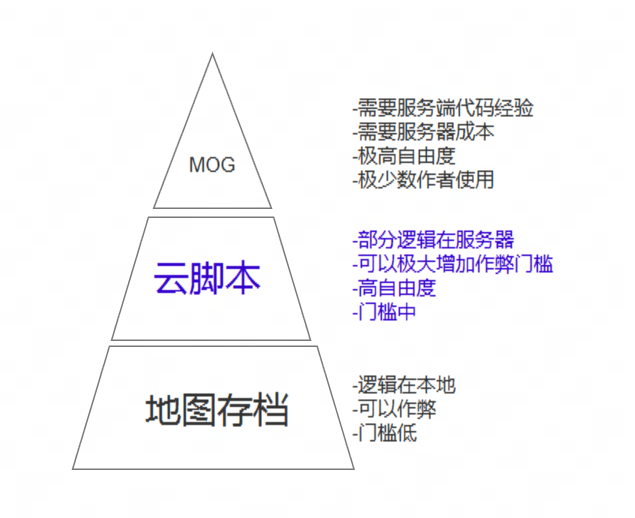

# 地图逻辑脚本服务(MLS) 

## 介绍
在帧同步游戏中，将部分ECA的逻辑转移到服务器中来进行  
利用服务器脚本功能，可以用到如下3个场景
- 防止玩家作弊  
  将地图中的一些关键存档保存，放到服务器脚本中，如玩家闯关，击杀boss,掉落装备，战力计算这些地图核心的数值和逻辑。 通过服务器脚本来进行综合和复杂的判断玩家是否完成条件，从而到达防止作弊的目的。
- 防止直接盗图  
  将一些核心的逻辑和数值放到服务器脚本中 
- 丰富地图玩法  
通过部分逻辑放在服务端，可以做一些更加丰富的扩展玩法。 

## MLS 的框架
>  地图逻辑脚本服务(MLS)的框架如下所示

## MLS的核心流程
> 对局中的核心流程交互如下图所示

## 脚本支持
- Lua  5.3.6 版本

## 地图逻辑脚本服务和rb连接服务的区别

| 标题1 | 地图逻辑脚本服务 | rb连接服务的区别 |
|-------|-------|-------|
| 维护成本 | 不需要作者维护服务器 | 需要作者自己的部署、维护服务器、防止黑客进攻等 |
| 同步机制 | 云脚本向客户端发送数据自动同步 | 需要多做一步同步操作 |
| 交互逻辑 | 云脚本向客户端发送数据自动同步 | 服务器无法直接操作存档、无法直接获取玩家平台数据 |
| 作弊检测 | 无法篡改数据，可防止作弊 | 容易篡改本地数据，存在作弊 |
| 编写语言 | LUA | Java,Python等其他语言 |

## 地图逻辑脚步服务和平台现有的技术对比
> MLS和MOG，作者之家配置的存档检功能对比

## 相关文档
### API相关文档
- [API相关文档](./API.md)  
###  
- [KKWE本地测试相关](./KKWE.md)  
### 示例demo
- [塔防游戏Demo](./demo/towner/)  
- [API测试Demo](./demo/apidemo/)  